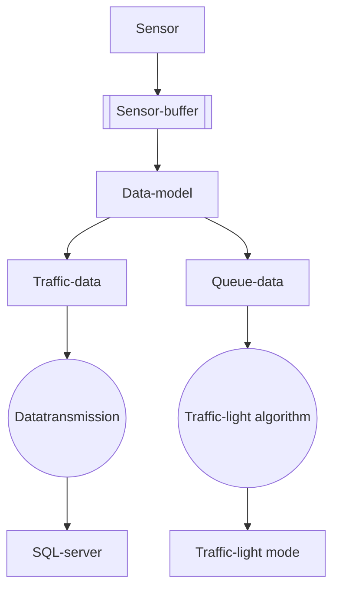
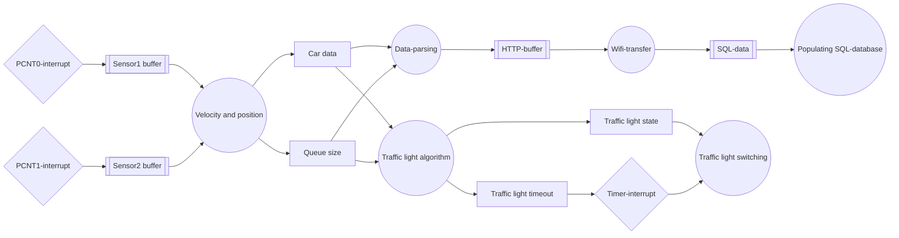
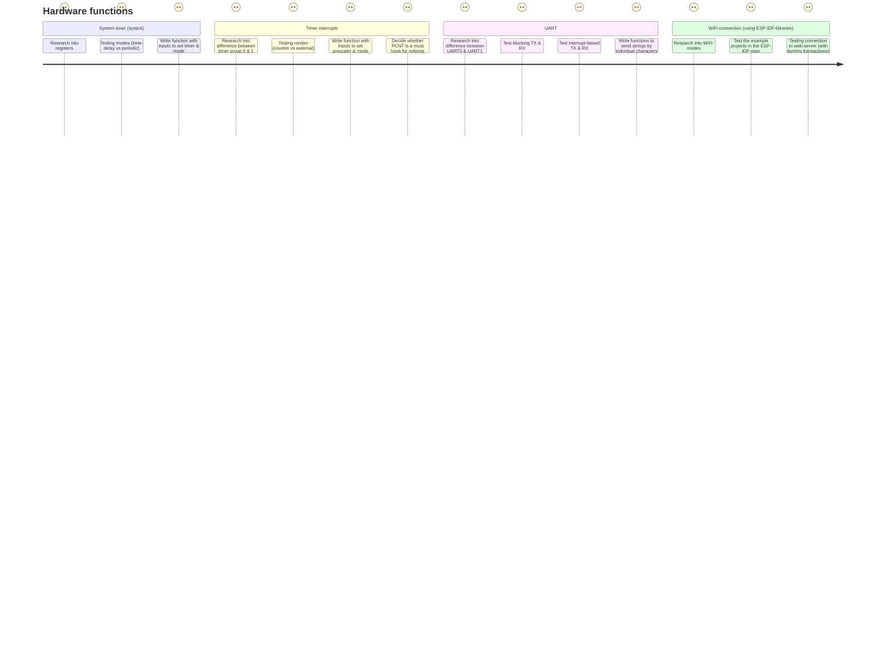
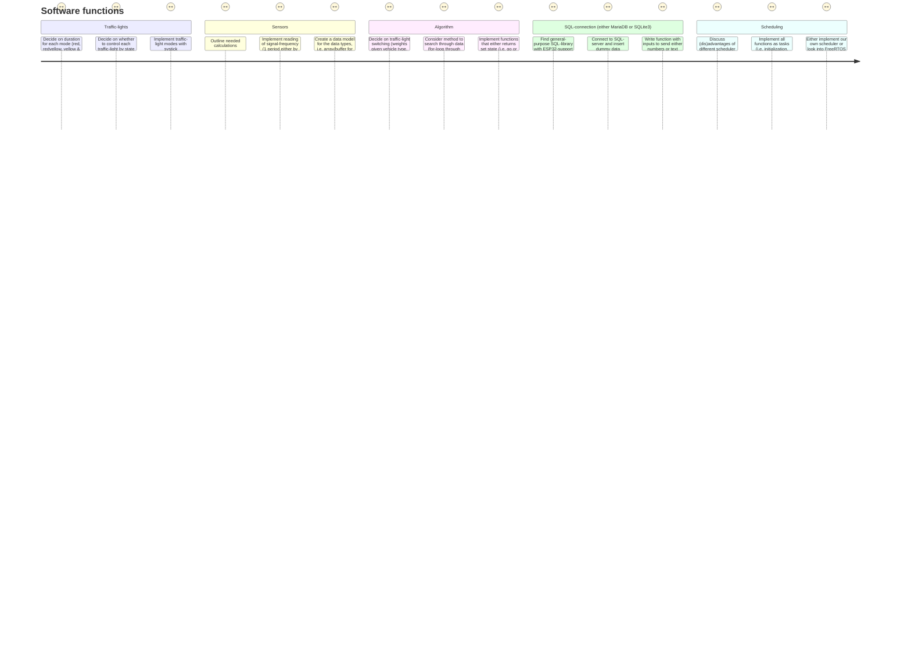
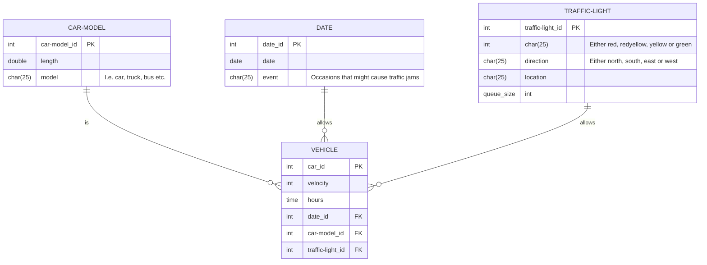

# Table of Contents

* [General task diagram V1](#general-task-diagram-v1)
* [General task diagram V2](#general-task-diagram-v2)
* [Implementing hardware functions](#implementing-hardware-functions)
* [Implementing software functions](#implementing-software-functions)
* [SQL schema](#sql-schema) 

# General task diagram V1

# General task diagram V2

# Implementing hardware functions

# Implementing software functions

# SQL schema

